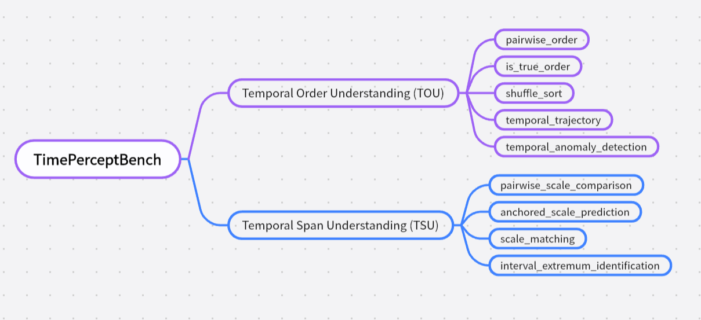

1. 闭源大模型引入、传统CV模型引入、这段时间内较新的开源大模型引入
2. 考虑不同地区变化速度不同，存在某一地区长时间不变和某一地区变化迅速的差别，TLE图像时间跨度人类也难以判断，可以尝试去掉，引入TOU新的子任务来替代（或者重构为变化速率预测，快/中/慢/无变化）
3. 在TOU任务的乱序重排，顺序正误判断，图像对先后判断的基础上，引入新的任务（时间轨迹推理，给出首尾两个时间点的图像，例如t1,t5，给出乱序的t2-t4作为答案，提问其中某个时间点的图像；或是往中间替换一个异常图像，让模型判断异常图像的时间点）
4. 设法证明多模态模型表现不佳是由于时间理解能力不足，而非计算机视觉图像与遥感图像在视觉内容上的差异（设计非时间任务，使用单图分类计算指标。多图场景对比，这两张图显示的是同一个地方吗，不要求理解时间，只要求判断空间一致性，
5. 补充人工指标
6. 修改论文论述
另： 代码和数据处理最后是会公开的，所以GitHub仓库问题暂时可以忽略

Temporal Order Understanding  
Time Span Understanding

1. 给定四张图像，判断前两张的图像的时间跨度大还是后两张图像的时间跨度大 （跨度比较）
2. 给定四张图像，给出图像1和图像2的时间跨度，图像2和图像3的时间跨度，预测图像3和图像4的时间跨度类别（天、月、年） （跨度预测）
3. 给定六张图像，问图像3和图像4的时间跨度、图像5和图像6的时间跨度，哪个更接近于图像1和图像2 （跨度匹配）
4. 给定一系列按时间顺序排列的图像（例如5张），要求模型识别出其中哪两个相邻图像之间的时间跨度最大或最小。 （连续跨度识别）

